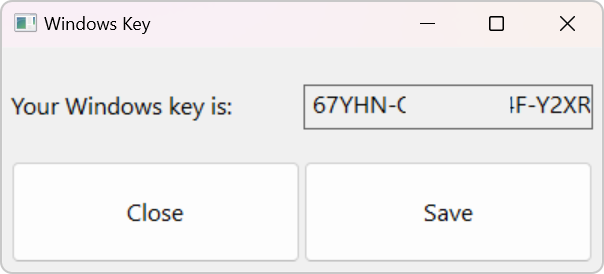

# Windows Key Retriever

A simple Rust program that retrieves the Windows product key from your system, displays it in a GUI, and allows you to save it to a CSV file.

## Using the Release Version

1. Go to the "Releases" tab in the GitHub repository.
2. Download the binary  `extract-windows-key.exe`  file attached to the latest release.
3. Run the downloaded executable file. The Windows key will be displayed in the GUI.
4. Click the "Save" button to save the Windows key and your computer's name to a CSV file named `windows_keys.txt`.
5. Click the "Close" button to close the program.

## Running the Program from Source

1. Clone the repository to your local machine using `git clone https://github.com/hansaskov/extract-windows-key`.
2. Navigate to the cloned repository's directory using `cd extract-windows-key`.
3. Compile and run the program with `cargo run`.
4. The Windows key will be displayed in the GUI.
5. Click the "Save" button to save the Windows key and your computer's name to a CSV file named `windows_keys.txt`.
6. Click the "Close" button to close the program.

## Dependencies

## Functionality

The program includes the following main functions:

- `main`: Initializes the GUI and sets up the event handler for button clicks.
- `get_computer_name`: Retrieves the computer's name.
- `get_windows_key`: Retrieves the Windows product key using a PowerShell command.
- `save_windows_key_to_csv`: Saves the Windows key and computer name to a CSV file.

## License

This project is released under the [MIT License](https://opensource.org/licenses/MIT).
